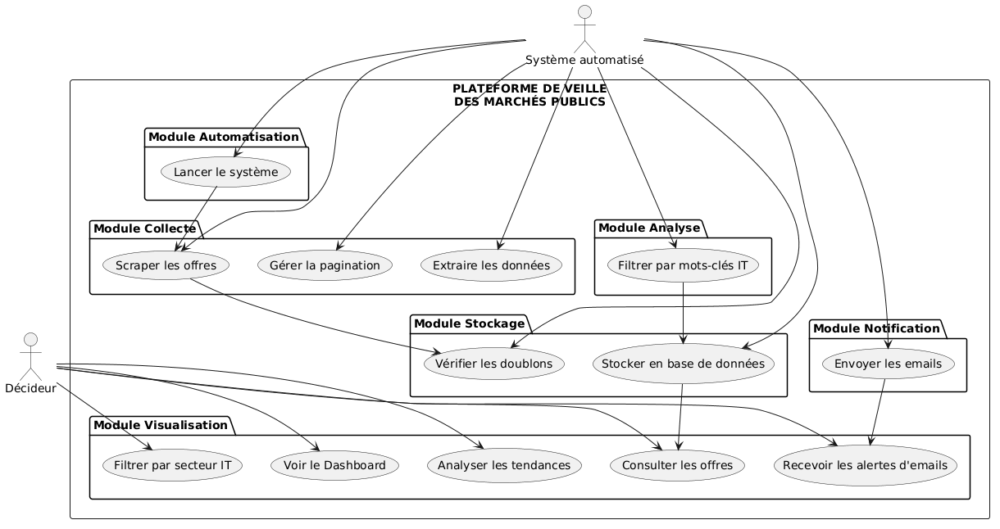
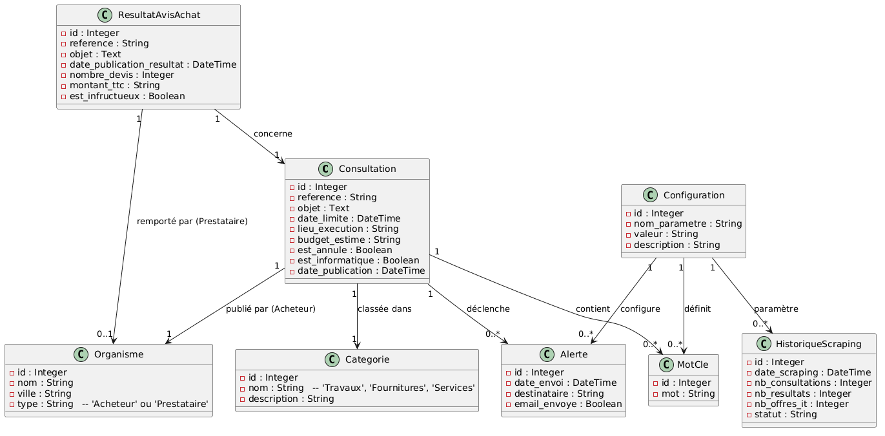
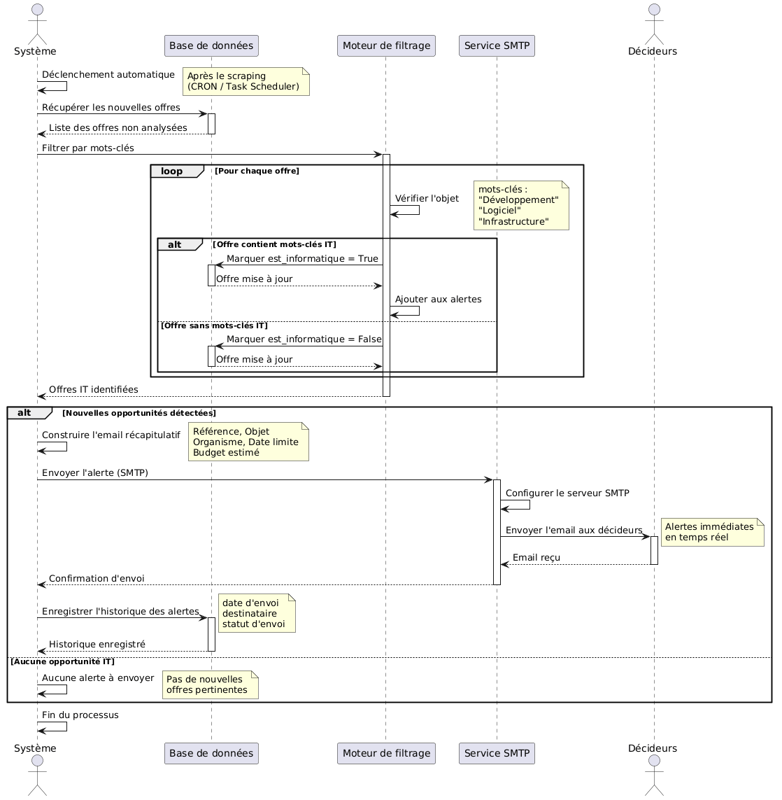
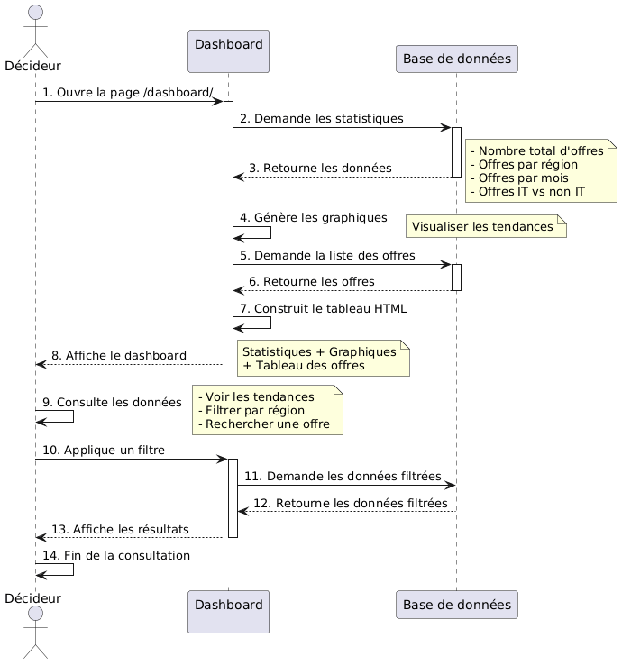

# Plateforme de veille des marchés publics

Outil automatisé de surveillance des appels d'offres publiés sur `marchespublics.gov.ma`, avec détection des opportunités IT et alertes en temps réel.

---

## Semaine 1 — Conception et base de données ✅

### 1. Use Case



### 2. Diagramme de Classe



### 3. Diagrammes de Séquence

**Scénario 1 — Scraping automatique**


**Scénario 2 — Analyse et Alerte des offres IT**



**Scénario 3 — Visualisation et Dashboard**



### 4. Base de données

| Élément | Valeur |
|---------|--------|
| SGBD | PostgreSQL 17 |
| Base | `marche_public` |
| Tables applicatives | 7 (Consultation, Organisme, Categorie, MotCle, Alerte, Configuration, HistoriqueScraping) |
| Tables Django | 10 |

---

## Semaine 2 — Développement du scraper 

```

### 1. Fonctions principales

## 🤖 Fonctions du scraper (scrape.py)

Le scraper est composé de **11 fonctions** qui travaillent ensemble pour automatiser l'extraction des offres.

---

### Tableau des fonctions

11 fonctions organisées en 5 catégories :

1. INITIALISATION
   get_mots_cles() → Récupère les mots-clés dynamiquement depuis la base MotCle

2. EXTRACTION
   extraire_toutes_offres() → Découpe le texte en offres
   extraire_donnees_offre() → Extrait Référence, Objet, Acheteur, Lieu, Budget
   extraire_liens_offres() → Trouve les liens de détail
   extraire_budget_simple() → Cherche le budget dans le texte
   extraire_categorie_depuis_detail() → Budget + Catégorie depuis la page de détail

3. CLASSIFICATION
   get_ou_creer_categorie() → Gère les catégories en base (normalise Travaux/Fournitures/Services)

4. GESTION DES DONNÉES
   get_ou_creer_organisme() → Gère les organismes acheteurs
   enregistrer_offre() → 	Sauvegarde en base avec vérification des doublons

5. ORCHESTRATION
   scraper_consultations() → Fonction principale qui pilote tout

ORDRE D'EXÉCUTION :
scraper_consultations() → Navigation → Extraction → Classification via page détail → Enregistrement → Pagination → Fin

---

   # remplissage des tables (TEST)
Table        	Rôle              	Nombre	
Consultation	Offres scrapées	    563	
Organisme	   Acheteurs publics   	 545	
Categorie    	Catégories	           3	(Service\Fournitures\travaux)
MotCle	      Mots-clés IT           19	

## Démarrage rapide

```bash
# 1. Cloner
git clone https://github.com/oumii-14/marche-public-scraper.git
cd marche-public-scraper

# 2. Environnement virtuel
python -m venv venv
venv\Scripts\activate        

# 3. Dépendances
pip install -r requirements.txt

# 4. Base de données
psql -U postgres -c "CREATE DATABASE marche_public;"
python manage.py migrate

# 5. Admin
python manage.py createsuperuser   
      admin / mdp: admin123

# 6. Lancer le scraper
python scraper/scrape.py


```
## Technologies

| Technologie | Version | Rôle |
|-------------|---------|------|
| Python | 3.12 | Langage principal |
| Django | 6.0.6 | Framework web / ORM |
| PostgreSQL | 17 | Base de données |
| Selenium | 4.45.0 | Scraping navigateur | (POUR PLAWRIGHT J AVAIT UN PROB D INSTALLATION)
| ChromeDriver | — | Pilote Chrome |


## Semaine 3 — Module d'Analyse et Alerte

### Mots-clés dynamiques

Les mots-clés ne sont plus écrits en dur dans le code. Le decideur peut les ajouter/supprimer/modifier via `/admin/scraper/motcle/`. Le scraper lit automatiquement la liste mise à jour à chaque lancement via `get_mots_cles()`.

### Catégorie extraite depuis la page de détail

La catégorie (Travaux/Fournitures/Services) est lue directement depuis le champ `Catégorie principale` de la page de détail de chaque offre sur le site, plus de détection basée sur l'objet.

### 📧 Alertes emails

Le script `scraper/alertes.py` vérifie quotidiennement les nouvelles offres IT et envoie un email récapitulatif au décideur.

Fonctionnement :

1. Vérifie les offres IT sans alerte
2. Construit un email récapitulatif
3. Envoie l'email via SMTP (Gmail)
4. Enregistre l'alerte dans la table Alerte
5. Lien vers le dashboard accessible depuis les emails d'alerte

Configuration SMTP :

```python
EMAIL_BACKEND = 'django.core.mail.backends.smtp.EmailBackend'
EMAIL_HOST = 'smtp.gmail.com'
EMAIL_PORT = 587
EMAIL_USE_TLS = True
EMAIL_HOST_USER = 'tonemail@gmail.com'
EMAIL_HOST_PASSWORD = 'motdepasse'
DEFAULT_FROM_EMAIL = 'tonemail@gmail.com'
```

---

## Semaine 4 — Dashboard & Automatisation

### Dashboard Streamlit

Visualisation interactive des offres avec graphiques et filtres.

```bash
streamlit run dashboard_app.py
```

**Fonctionnalités :**
Statistiques : total offres, offres IT, annulées, urgences, catégories, santé système
Graphiques : offres par mois, top 10 régions, catégories, IT vs non-IT, mots-clés les plus utilisés
Filtres : secteur, région, catégorie, recherche, plage de dates
Liste interactive des offres avec code couleur (vert IT, rouge annulé)
Export Excel des offres filtrées
Historique des exécutions du scraper intégré

### Historique de scraping

Chaque exécution du scraper enregistre un historique dans la table `HistoriqueScraping` : date, nombre d'offres trouvées, nombre d'offres IT, statut (Succès/Erreur). Visible dans `/admin/scraper/historiquescraping/`.

### Automatisation (Task Scheduler)

| Tâche | Heure | Fichier |
|-------|-------|---------|
| Scraper | 08:00 | `scraper/run_scraper.bat` |
| Alertes | 09:00 | `scraper/run_alertes.bat` |

```bash
taskschd.msc  # Planificateur de tâches Windows
```

---

### ✅ Résultats

- Dashboard opérationnel
- Graphiques interactifs
- Filtres disponibles
- Mots-clés dynamiques (modifiables via admin)
- Catégorie extraite depuis le site
- Historique de scraping automatique
- Automatisation configurée
- Projet prêt pour la production
